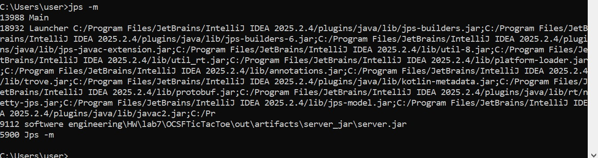
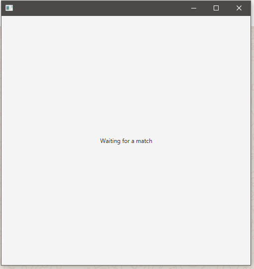
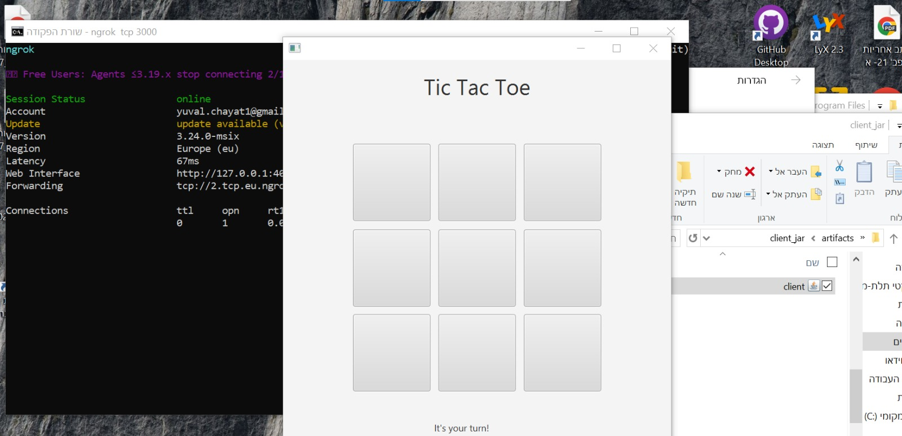
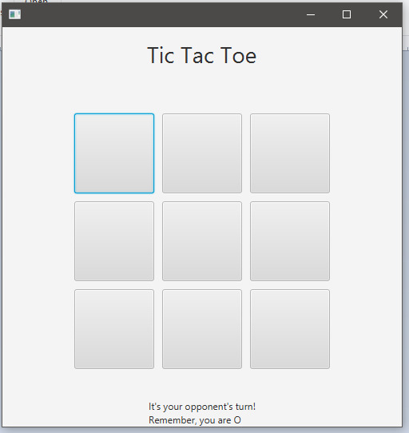
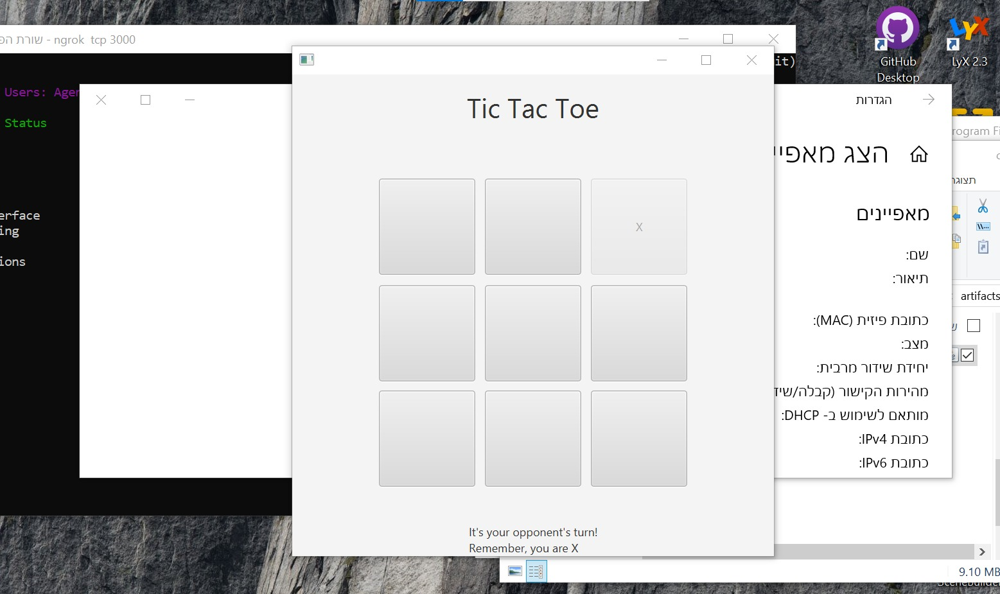
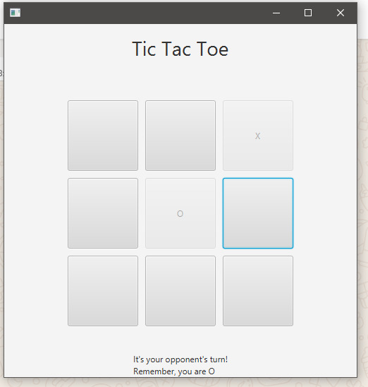
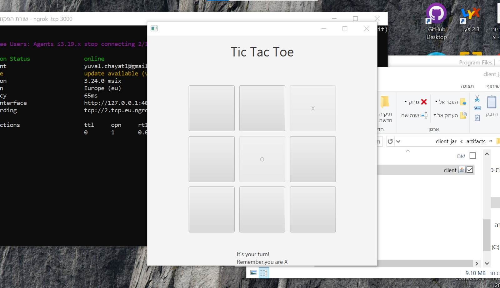
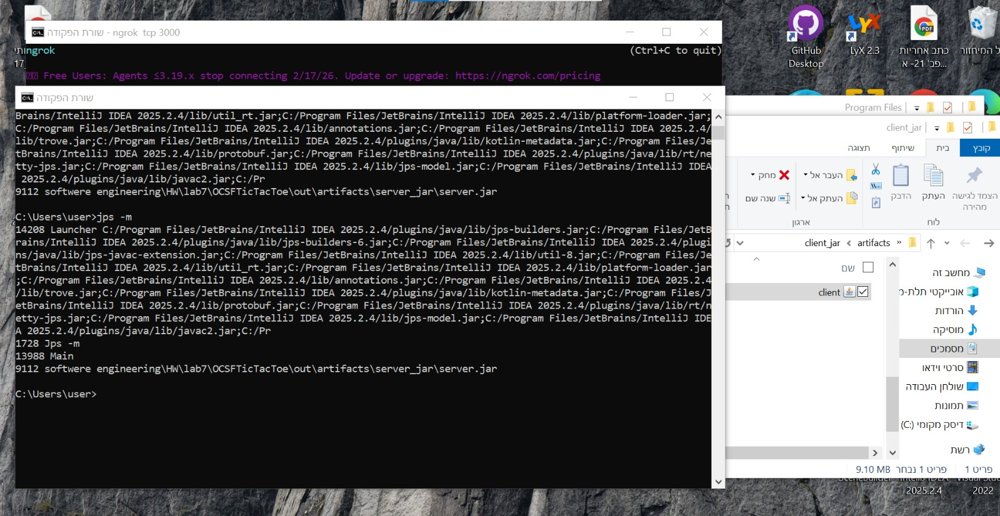
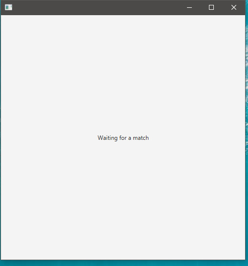

## names
Yuval Hayat
Rani Hasan

## jars
the jars file exist under the folder /jars

## images
1. server initialized on pc 1.   

2. client 2 joined from pc 2 and entered the waiting queue. 

3. client 1 joined from pc 1 and started the game with client 2. 

4. client 2 started the game with client 1. 

5. client 1 made a move. 

6. client 2 received client 1 move's and he played his move. 

7. client 1 received client 2 move's. 

8. client 1 left the game. 

9. client 2 got sent to the waiting queue. 
